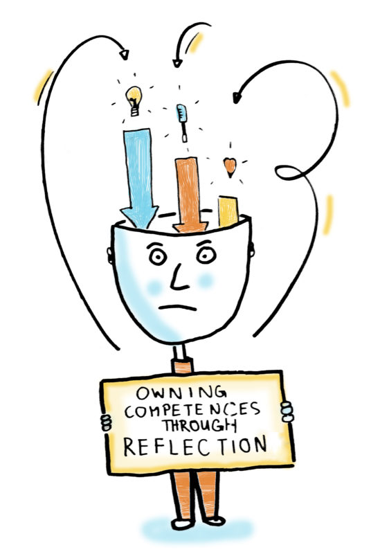

Going into this class, Software Engineering seemed so arbitrary. I thought hmm if I shot high enough maybe I'd be smart enough, but it wasn't anything more than an unobtainable goal I kept in the back of my head. Coming out of this class, I feel like maybe it is something I can do. Software Engineering is difficult, don't get me wrong, but challenges can always be solved if you put the effort to do so. The one thing that discouraged me in the beginning of this semester was seeing how advanced some of my classmates were in their respective interests: some had a few internships over the summer, others had a job lined up for after they graduated, and some just knew more languages than I did. Now that I'm on the other end of it, I know it's a journey. Nobody is upset that you don't know something, they either don't know as well or they've been there before so they know how to treat the situation. ICS 314 overall has been a big learning curve and I'm glad I took it. My three biggest takeaways have to be: UI Frameworks because thank goodness they exist, Coding Standards like ESLint to catch all my errors, and IDPM (Issue Driven Project Management) that helped address all concerns with the scary group project.

## User Interface Frameworks

Though it was a pain to learn how "picky" these frameworks' rules were, it did save me a lot of time and organization in the end. UI Frameworks gave me a simple way to make websites more uniform, appear cleaner, and overall make it easier to design a website. Without it, my website would not be user friendly or readable for anyone. The UI Framework we worked with in ICS 314 was Semantic UI which gave me the power to pack everything into <Container></Container> and make my headers look like headers with <h1></h1>. These may be simple things, but for a beginner like me, it was so helpful to have a guide that makes everything look uniform so I wouldn't have to worry about trying to figure all of that out on my own.

## Coding Standards

Another tough cookie because nobody likes a perfectionist, but it served me well. Once I got the hang of how to utilize ESLint and even have it correct my errors for me, it was a breeze. It became part of my habit and I couldn't do anything without making sure ESLint approved of it. Coding standards in general are not always the most likeable, but they are there to ensure we as software engineers don't get lazy and that we are held accountable to some effect. I like that ESLint is basically my autocorrect because without it, I would miss a few semicolons or commas. Trust me- those make all the difference to see why your program is failing. Not only does it make programs work, but it also makes you a more credible software developer as it ensures you hold your work to a standard and the work meets requirements that may otherwise have been overlooked by others who don't have coding standards.

## IDPM (I Don't Partner Much)

IDPM was a great way to best manage projects. I wish I knew more about it sooner as it allowed me to have power and say in situations where I am working in a team. I think the beauty in it is simply being able to effectively communicate knowing you have a baseline of expectations already set down before even starting the work. In my previous experience with group work, there would always be a last minute scramble to do "whatever you can" to turn in by 11:59pm. This time around, I have been lucky enough to have teammates who are so good about communicating and doing the work assigned to them by our set due dates. Though procrastination may still be an issue, having teammates that support you and ensure everyone got their parts done was super helpful in my opinion. Not having a ton of healthy work flow in group projects in the past, the IDPM guidelines really helped me to see how to operate both myself and group interactions so that communication and work flow could be up to par with standards set by the IDPM. Simple things like meeting at least twice a week, assigning different issues to different people, and creating milestones to have check in conversations made all the difference. My group had a few issues along the way because our project was ambitious, but I believe we did the best we could and had a pretty good communication system throughout the entire process.

## Conclusion

ICS 314 is an intro to Software Engineering, but I know that this is not where my journey with software engineering ends. This has been an whirlwind of an experience and I appreciated every challenge that got thrown to me. I learned the most from this class and was also challenged the most in this class. Software engineering is not something for people that don't want to put in the extra effort, but it is something everyone should at the very least learn about so that they can obtain some valuable lessons and knowledge from this course.
