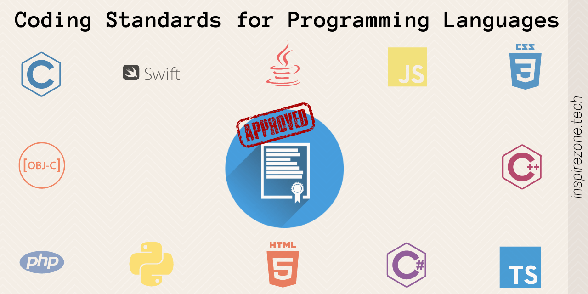

*News Flash: coding standards DO matter!*

It is very easy to be lazy and say: well it doesn't matter how I got here, as long as I did it. As easy as it is to not care about the quality we put into our work, it is so important that we do adhere to some standard we or others hold to our work. In coding, some are quick to say "as long as my code works, it doesn't matter what it looks like!" To software engineers, however, it does. Coding standards are in place to hold individuals accountable for the work they produce. Not only does it help you, the coder, understand programming languages better, but it also helps others to see what your intent was with ease. Coding standards allow software engineers to build efficient code, that can even be used for more than one specific issue sometimes. 

## ESLint 

In ICS 314, we are being taught how to think like a software engineer. Finding the most efficent, reusable code is always the goal. How do coding standards play into this? Well, it's quite obvious: you can't have good, efficient code if you don't adhere to coding standards. In this class, we are currently using Javascrip for our coding language. There are many different standards for various different coding languages, but we are using ESLint with IntelliJ for our coding standards. 

ESLint is a linter that aids by checking Javascript code for a number of issues such as syntax errors, code style violations, potential bugs, and formatting issues. My overall experience using ESLint has been pretty positive. I appreciate how it shows you any errors before you run your code. It helps in saving time between running, troubleshooting, rerunning, and more troubleshooting until the problem is found and solved. When ESLint finds an error in the code, it will highlight and a warning will appear to let you know you have an error in your code. 

## Coding Standards Helps Everyone

The most benefits to adhering to coding standards is when working with other people. In reality, everyone has their own way of doing things; no two people will have the same exact coding style. When people working together in a group all adhere to the same coding standards, it allows for more agreements and understanding within the group. This further allows for more efficient work groups can accomplish with less time spent on coding quality or styles and more time figuring out how to solve the actual problems at hand.

## How Coding Standards Can Work For You

As someone who is new to coding (especially in Javascript), it was so easy to brush off my mistakes with excuses like "well I'll get it next time, as long as the code worked." With ESLint, I was able to see and correct my errors along the way. Repeating this process with many assignemnts along the way has helped me to really learn from my mistakes. My bad habits of not closing a loop or even just forgetting a "_." before an underscore function have become a less frequent occurance since learning to fix along the way with the help of ESLint. 

## Conclusion

Coding standards are not meant to tell you that you're wrong, but rather that there is a better way to write the code. It saves you sometimes as it even allows for better readability of your code, which makes your ICS professor really happy! When you first use coding standards, it might be a pain to set up or annoying to see all your errors in the code, but forcing yourself to use and adhere to coding standards is a big game changer. You not only allow for better readability, but it helps you to better understand coding languages and just makes everyone happier overall. Not to mention, there is something so rewarding about seeing that green checkmark in the end!
