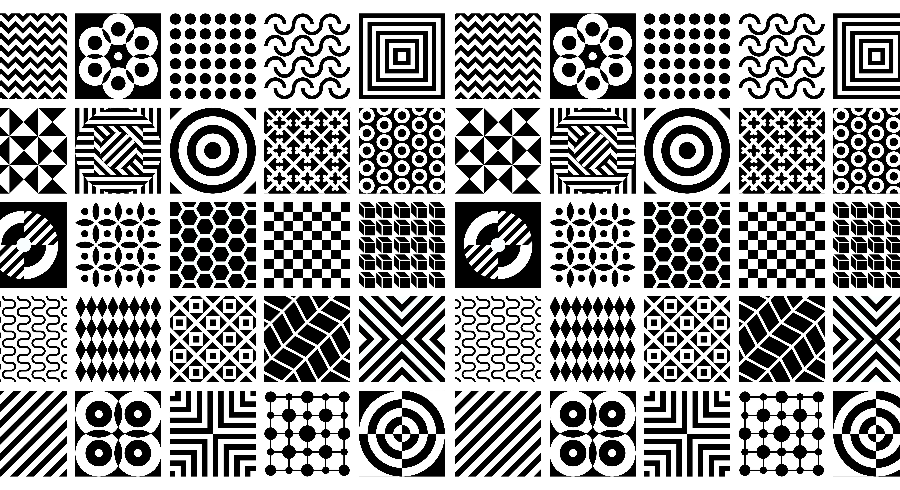

 

In my experience with coding, not once did I think "hmm, nice design pattern used here." I usually associate the phrase design patterns with clothing: plaid, stripes, dots, floral, etc. Up until this semester, I didnʻt realize what design patterns were for someone in Computer Science, but I quickly learned how important they are. Every project Iʻve done in this class has used some type of design pattern and that is no surprise. A design pattern must be followed carefully just like the patterns in a clothing piece or else it won't work; it isn't a pattern.

## So.. what are desing patterns?

Although patterns can be very intricate, let me break it down for you just a bit.

The ideal SIMPLE design pattern usually follows:
1. Finding an issue many other software engineers have encountered.
2. Create an in depth description of the solution, which includes all of its relationships like classes and objects involved.
3. Include any consequences for following/using the design pattern.
4. Name the pattern with the most descriptive, obvious adjective turned noun.

The four main design patterns that I know are common are: Factory, Observer, Singleton, and MVC. Since this isn't a lecture, I'll let you learn about it on your own time.

In total, design patterns are just guides on how to approach a problem. They're created by fellow software engineers to overcome common issues we all run into. So thank you to the people that did the hard work for newbies like myself!

## Newsflash: I HAVE used design patterns?

Yes, shocker. I have actually used design patterns. (And without even knowing it!) 

In my final project, I noticed we used a lot of the Observer design pattern. The Observer is one that defines a one-to-many dependency between objects so that if one object is changed, all dependents are notified and updated automatically. There is usually an observable subject that maintains a list of dependents (or Observers, hence the name of the design pattern) and notifies of any state change which then promotes loose coupling between components. Our project is all about notifying users about upcoming campus events they have subscribed to. So it makes sense that once an event is coming up on the date, a notification would be pushed to students who have "observed" that particular event.

## Design patterns = solutions

The main takeaway is: all software engineers have used a design pattern in their life whether they know it or not. Design patterns aren't just for pretty clothes, it's for solving common problems. It's easy to just see projects and not over analyze which patterns were used, but educating yourself and knowing more about these patterns definitely make comprehension of coding way better.
Let's just say thank you once more to the amazing software engineers before us that came up with these patterns. They really saved me from a lot of headaches!
