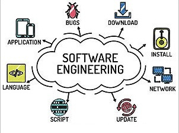

  

*Spoiler alert: there is such a thing as a stupid question!*

From the time I was in primary school, my teachers would always drill it into my brain that there was no such thing as a stupid question. This was simply to get more students to not be afraid to ask questions if they needed help. While this was a great encouragement for elementary school level students, this saying does more harm than good now as a college student. As a computer science major, there were many instances when I have been stuck on a coding assignment and had to do a quick google search to resolve certain issues. With the tools and resources my generation especially was provided with, I believe it has gotten increasingly easier to ask "stupid questions." So that begs the question: what is a stupid question?

## Smart questions, explained

A smart question is one that leaves no room for any ambiguity. According to the article How To Ask Questions The Smart Way by Eric Raymond, software engineers are not and should not be tolerant of those who are unwilling to do before asking. Asking questions before even attempting a solution or trying to understand what the issue is will more than likely lead to a stupid question. For software engineers in particular, asking smart questions is a must in order to be taken seriously. Mastering the technique of asking smart questions shows that you have the competence and professionalism required to interact with other software engineers. By asking stupid questions, we hinder ourselves and others from learning, the answer will only get you a good grade on an assignment, not understanding for yourself and the class.

## The smart way to ask a question

Smart questions should be one that is specific to a problem, asking for better understanding. Most smart questions will contain a lot of context to not confuse any potential repliers with their issue. Stack Overflow is an internet site in which many people can ask and/or answer questions, built specifically for those creating open-source projects. On this site, there are a multitude of questions, both smart and stupid, that are asked, and as you can tell, some are not answered for obvious reasons. When asking smart questions on a site like this, it is imperative to keep in mind the audience is far more experienced people of the computing and programming world. With this in mind, there should be a level of professionalism in the question and body of the question so that no follow up questions will be required and it can be answered rather quickly. An example of a smart question asked on Stack Overflow is linked here. In this particular question, this person is asking how to troubleshoot an issue regarding why an app keeps crashing if they are also running other applications in the background. The ask was how to have the program ask to swap space rather than automatically crashing if there is a memory shortage on the device. This is a great example of a smart question because it shows they have knowledge on what they are asking about, not just asking for a short answer. They have provided their script and even a detailed description of how their device is operating in terms of storage as well as system information. From the support code to the context of available RAM on their hardware, it is clear they understand what they're talking about and only included relevant pieces of information in order to help solve their issue.

## The not so smart way to ask a question

Contrary to smart questions are not so smart questions, or stupid questions. These types of questions have a lot left up to interpretation, are too simple to learn anything from the answer, and do not have the correct formalities to really be considered a question worth answering. On Stack Overflow, there are many questions that are considered stupid questions; they simply ask for the answer and don't care about the explanation. One example of this is liked here. This question presents a problem regarding how to get rid of the weekends from their graphing of a time series data graph. For starters, there is very little context provided, no suppor code is given to help troubleshoot, and the little information that is provided is not elaborated enough upon. Though I personally cannot troubleshoot this issue, I do believe this could be resolved with a few google searches. This is a classic lazy question in which the author does not want an explanation to understand but rather just wants an answer and to move on with their life. Though it may be a simple question to answer, it is not worth the time or energy of an advanced person of the tech world to answer because the professionalism does not exist in the question. There is nothing to learn from reading the answer to this question unless you, too, have this very specific problem. This person set themselves up for a question that will most likely not be answered.

## Questions going forward

There's a lot to learn from this. Not only does Eric Raymond explain how to ask and formulate a good question, but his article helps to understand the importance of maintaining a habit of asking smart questions. It is often easy to be lazy and as for an answer, but as a computer science major in a software engineering class, it is imperative I learn from this as my grades and future could depend on it. Starting now, I need to be more consious of the questions I ask because I do admit, I am very guilty of asking stupid questions. There is so much more I can gain if I just reevaluate my question and format it to be smarter. Smart questions don't equate to automatic success, but stupid questions definitely will not get you anywhere.

