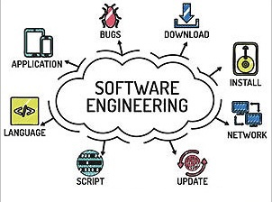

  

Going through high school, I had no clue what I wanted to major in when I got to college. I had a hobby of photography, but I knew it wouldn't be a sustainable career as the market for photographers is not great at the moment. I thought about just doing what everyone I talked to was doing and just go into business, but I don't know. Something about doing someone else's taxes or creating a company's payroll didn't quite appeal to me. I really just did not have any direction. However, during my spring break of senior year in high school, I was invited to join an online boot camp to learn about cybersecurity. In this bootcamp, I, alongside many other high school girls, learned about cybersecurity, the implications and importance in our lives, learned a bit about cryptogrophy, and some basic coding to generate a random password. This experience was intriguing to me so when it was finished, I thought
* why not just go for computer science?

## What am I doing here?

To be honest, I don't think I'm totally qualified to be in a level 300 ICS course. That could just be a confidence thing, but I really do not have nearly as much coding experience as a lot of my peers right now. When we came back from summer, a lot of students shared they just finished their internship doing coding stuff or just finished an ICS summer course. As someone who did not do either over the summer, to say I was intimidated by these standards was an understatement. I have very little coding background: I took ICS 111 and 211 at UH West Oahu and was taught python. We had no "projects" per say in those classes and I personally did not really retain any of the information well. So to hear that half my peers were masters at Java, C++, C, or even JavaScript was very intimidating. However, I found that if I just spend a couple hours teaching myself on sites that offer Javascript practice for free, I can actually learn what I need to know to do okay. ICS 314 is literally titled "Software Engineering I". Have I ever really explored software engineering as a career path? Not really. After a quick google search, however, it seems like it might be a niche I've found.

## Is this the career for me?

Everywhere I go, I'm always asked the same two questions as a college student: what's your major? and what do you want to do with your degree? While I always said computer science as my major, I never really knew what to say for where I wanted to start my career. I just always assumed that I would just know later, I guess. Going through various classes as a computer science major, I would say there are many different paths to take and none of these paths are really a one-size-fits-all type of situation. Many people are on the data science track, while others want to go into game development, yet others are super interested in cybersecurity. I had no idea where I wanted to place myself. I wanted to incorporate my creativity from my love of photography, but I also wanted structure in the sense that creating whole new games seemed a little intimidating. When I heard about software engineering, I was scared at first. It seems like a lot to be the one creating apps and developing solutions to different companies' software issues. However, I am starting to like it. It allows you to be creative, but there is some structure to doing it.

## What's there to like?

As much as I enjoy being able to just follow instructions and turn off my brain for a little, I also find fun in being able to explore my creative side. Computer science itself is a harder major, but the whole reason I enjoy it is because I enjoy problem solving. Math was always my favorite subject, so to incorporate that concept of problem solving into a career option like software engineering was cool. I'm able to problem solve, but at the same time, there is more than one way to solve the issue. I always hated teachers who got mad at me for not doing it "their way" so to see that there are multiple ways to do something and get it done or get it working was exciting to me. I like that it incorporated having such an open mind to many solutions while still keeping in mind the end goal is to troubleshoot problems. Software engineering is complex, but it comes down to creatively solving problems. It's much more than that, obviously, but it seems fun and likeable.

## How I am going to get there

There's a lot I need to learn and improve on. I will always be constantly learning and growing, even after I graduate college. The biggest thing for me is to stay focused, be humble, and gain confidence in myself. Software engineering can be intimidating, and it definitely isn't for everyone. However, with the right mindset and proper skills, I think I'll be okay.

