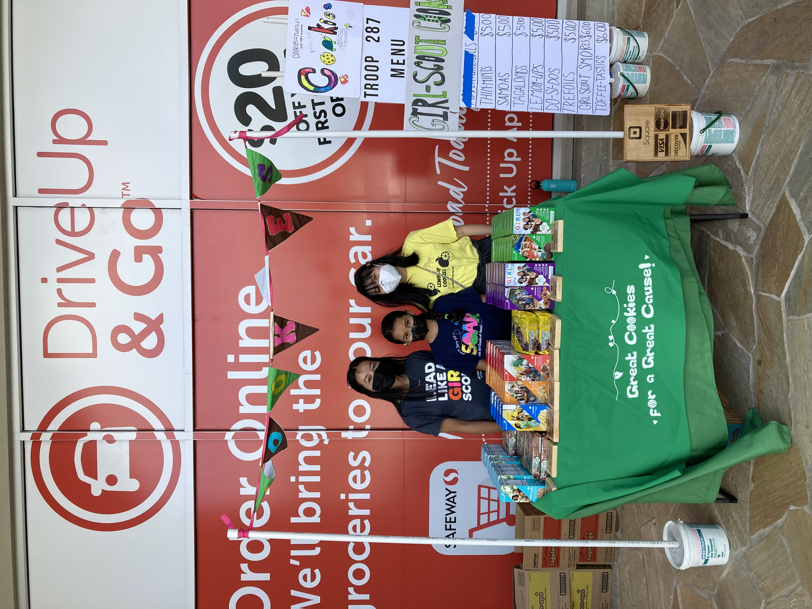
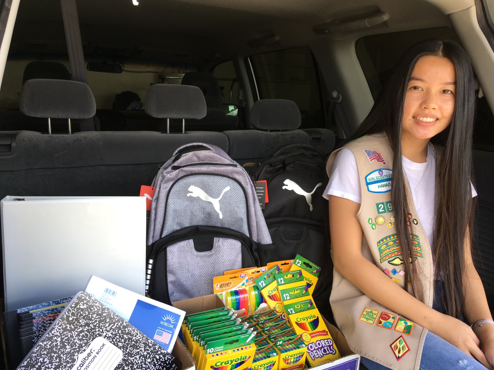
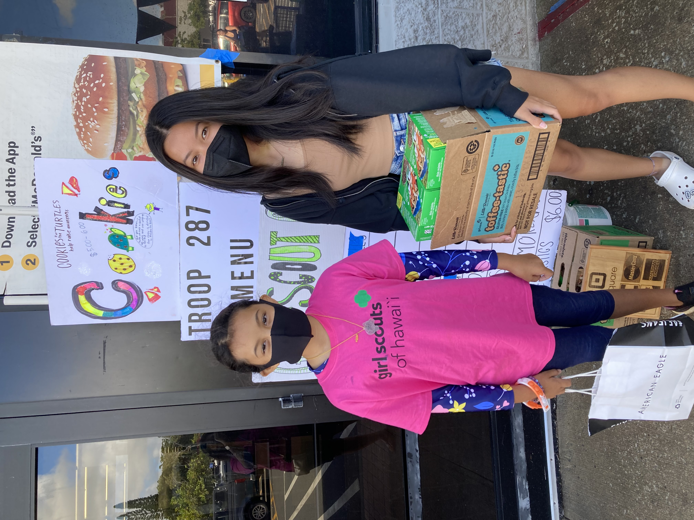

  
  
  

Girl Scouts is an organization in which girls come together and learn to build skills that help them in the real world. Some include: first aid, outdoor resourcefulness, teamwork, STEM, and community service. I was a Girl Scout for about 11 years and my troop did various community service projects such as raising money to donate to an organization in South Sudan to help build and supply schools for children (including girls) so they can have a proper education to prepare them for the real world. Another community service project we did was raising money and collecting donations to help donate and supply the Hawaii Food Bank, the Hawaiian Humane Society, the Salvation Army Angel Tree, and various foster care children during the back to school season. All of these projects together may not have a lot to do with coding, but contributes to the reason I decided to get into Computer Science, with an interest in Cybersecuirty: to help my community.

Throughout my time in Girl Scouts, I have built confidence in my leadership and teamwork skills. I have been taught and mentored by a lot of strong women, a lot of which were in STEM. One mentor in particular was a civil engineer who was tremendously helpful in encouraging me to pursue a career in the STEM field. In all community service projects, I helped in researching which organizations to help with the money we raised, ran various cookie booths alongside other fellow girl scouts (Girl Scout cookies were the main way to raise money as all proceeds went into the take action project we chose for that cookie season), and assisted other troops in their cookie sales so they could raise enough money to complete their own community service projects. All of these experiences have prepared me to be a better part of the community whether it be organizing a booth, planning a meeting, or just showing up to help where I can.

To learn more about Girl Scouts and take action projects, click [here](https://www.girlscouts.org/en/cookies/how-to-buy-cookies/cookies-frequently-asked-questions.html#:~:text=The%20net%20proceeds%20from%20Girl,impactful%20girl%2Dled%20community%20projects).

