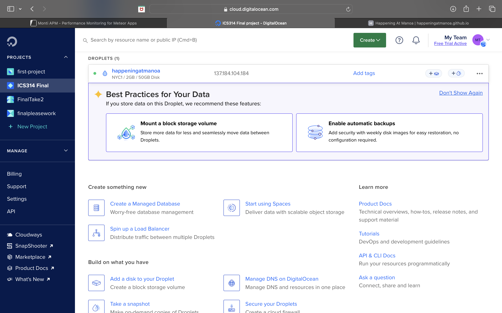
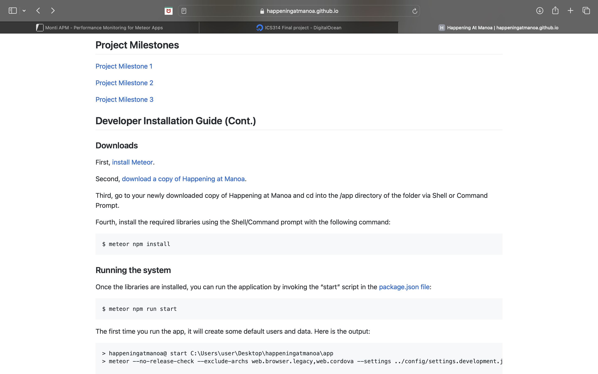

  
  

Happening At Manoa is an application intended for UH Manoa students. In an effort to get more active members of the UH Manoa student body, my group and I decided to create an application where students can explore various club and campus events. After exploring, students are prompted to "RSVP" or subscribe to events they are interested in attending. This subscription will allow a notification to reach them as a reminder to attend the events they were interested in. We believed that this application could be very useful for the average student because student life is busy; having a simple notification/reminder sent out about an upcoming event can be helpful as some people may forget. This application was intended to be a helpful tool for students who either need that extra reminder to attend various events, or even introduce students to different events they would've otherwise never heard of if they had not used the application.

My contributions to this project included: creating some base mock-ups of the site (helping to set a "vision board" of what our final product may look like), creating some pages on the actual site like the "Contact Us" page to better support the usage and communication between creators and users, contact any interested clubs (who generate the most events campus wide) that wanted to be a part of testing the application, and troubleshooting various tricky deployment issues when it came time to deploy the application (have the application go live for students to use on their own time). 

Overall, this project taught me a lot. While I do think there are still a few things I and my group could've improved on, I think the overall idea and execution was a great team effort attempt. There were many challenges for me personally when it came to deploying the application. Specifically because this was my first time using Digital Ocean, the program we were tasked to use to make the deployments. I had a lot of error messages that I had to solve through (getting the right assignment to unique ID, creating a droplet of appropriate size, and some that I didn't even know how to solve like an issue with an IP address). Overall, I think if given enough time (and an actual hard drive to store enough information), this application could potentially be something UH Manoa uses as a way to better connect students with events other than through club fairs or weekly newsletters which some students don't participate in actively.

To learn more about Happening At Manoa and my amazing team behind the code, click [here](https://github.com/happeningatmanoa).

Here is the link to our [project homepage](https://happeningatmanoa.github.io).
