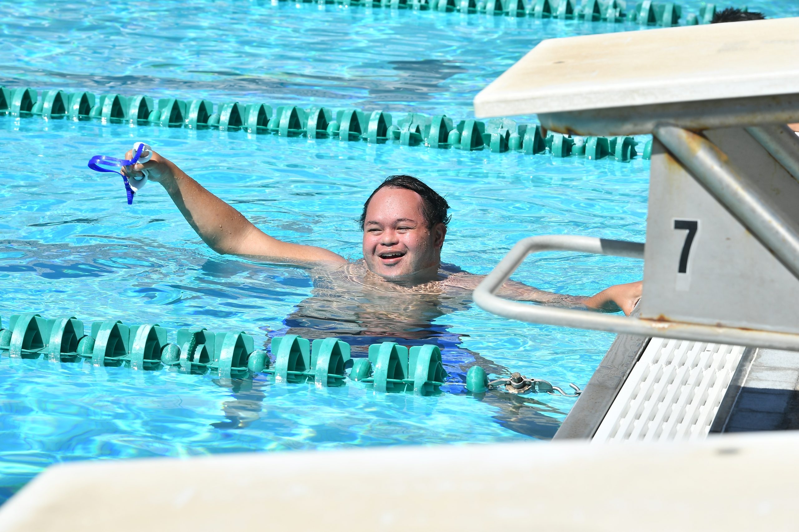

  

  

Special Olympics Hawaii is an organization to support individuals with disabilites in their passion to be athletes. These events are held to showcase talent even in the disabled communities. Being a part of something like this is so rewarding as helping those who have faced a lot of odds in their lives succeed at something they enjoy is a great thing to celebrate. It's organizations like these that allows these special individuals to build up the confidence to embrace their differences and come together to support one another in their talents and passion. 

I, alongside many others, volunteered to help run this event. We ran around and did a lot of things: helped set up, take down, keep score, encourage athletes, run various booths, ensure all athletes and families got lunch, and keep time of athletes competing. Although none of this really translates into coding, this volunteer opportunity was a great experience to be more in touch with the various differences some people live with. It is inspiring to see how I can help them and there are great implications in coding to aide those who have disabilites requiring special technologies to function in society. 

You can learn more at the [Special Olymics Hawaii site](https://sohawaii.org).
