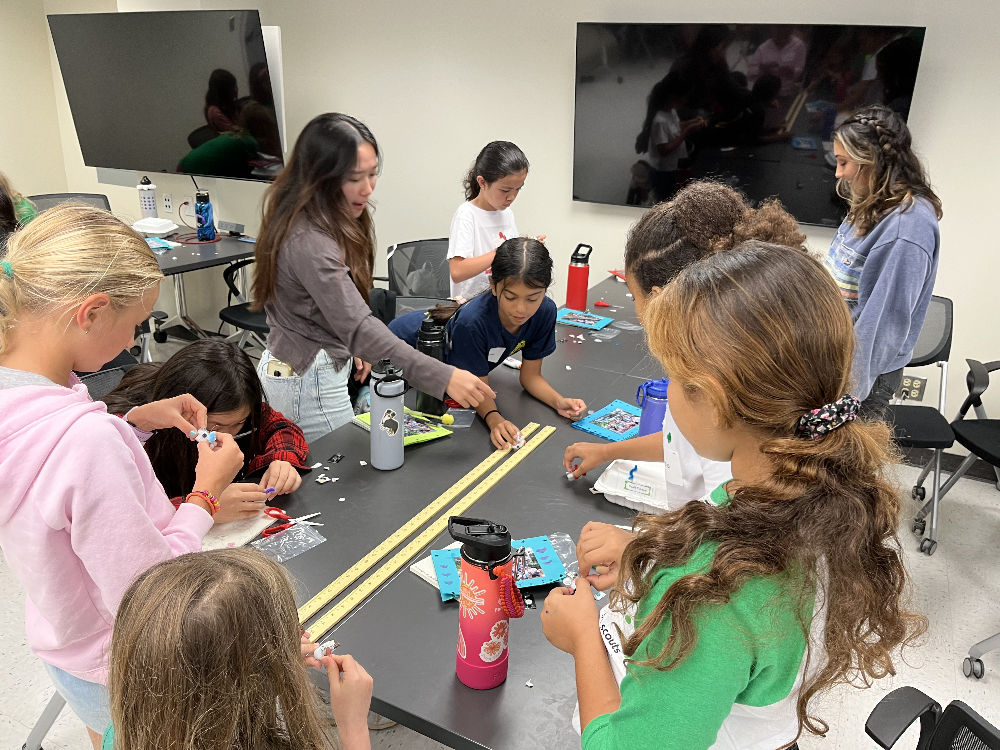

  
  
  

The University of Hawaii Manoa has a SWITCH club, which stands for: Supporting Women in Information Technology and Computing in Hawaii. This club puts a strong emphasis on encouraging women especially to continue on their journey as a Computer Science, or even just a STEM major. As we all know, the STEM field is very male dominated, which makes it discouraging for women to often pursue a career in this field. It's groups like this one that helps to build confidence in women by creating a safe community where women don't have to feel so threatened to be interested in their pursuit of a STEM degree. This club does a wonderful job of helping women to find their community of fellow supporters who can mentor them on their journey as well as get through their college (and beyond) careers without the crazy intimidation society puts on women.

In this event, fellow college students majoring mostly in Computer Science from UH Manoa came together and ran a day event where girls from across the island were able to come together and learn about STEM. It's important to teach at a young age and encourage a healthy relationship with this subject as it could plant a seed of interest in their future. We led girls ranging from upper elementary school through intermediate school in activities that explored STEM concepts like engineering, electrical circuits, and even art (making it a STEAM event). These girls all learned to cheer each other on in competition, help their peers if they could, and shared ideas with one another to uplift their friends. All in all, STEM is an important concept these girls got to experience in a fun environment. This STEM day really encouraged me to be more active in the STEM community and build up my own support system to continue on my own journey as a Computer Science major.

You can learn more about the UH Manoa SWITCH club at this [link]([https://manoa.hawaii.edu/news/article.php?aId=2857](https://switch-uhm.github.io/about/)https://switch-uhm.github.io/about/).
